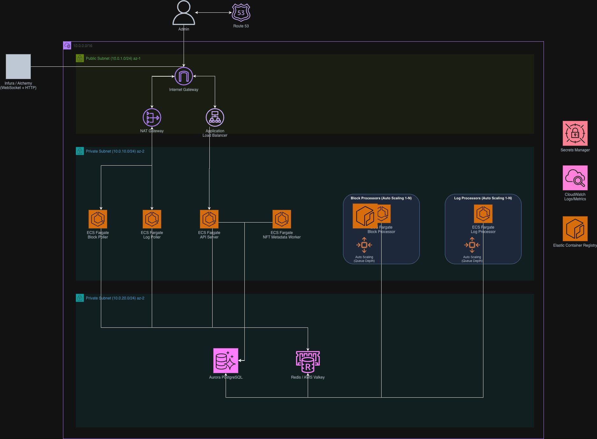

# Shafika

An open-source Ethereum indexer that crawls and ingests blockchain data for you to own.

## AWS Deployment Architecture

Shafika is designed to scale on AWS using ECS Fargate, with auto-scaling based on Redis queue depth. The architecture uses VPC isolation, NAT Gateways for secure outbound connections to Ethereum RPC providers, and separate subnets for compute and data layers. This diagram is built with AWS components, however, similar can be built across GCP or Azure.



## What Gets Indexed

Right now, Shafika indexes the essentials from Ethereum mainnet:

- **Blocks & Transactions** - the basics with timestamps, gas, and USD values
- **ERC-20 Transfers** - token movements with normalized amounts
- **Token Balances** - real-time running balance snapshots for ERC-20/1155
- **NFTs (ERC-721/1155)** - transfers plus automatic metadata fetching from IPFS
- **DEX Swaps** - Uniswap V2/V3 and SushiSwap events
- **Contract Deployments** - who deployed what and when
- **Address Stats** - aggregated activity per address
- **Gas Fees & Burnt ETH** - track network congestion and historical costs (EIP-1559)

Everything tracks the canonical chain, so reorgs don't mess up your data.

## Requirements

- **Docker & Docker Compose** (recommended) OR Python 3.11+
- **Ethereum RPC Node**: HTTP and WebSocket endpoints (e.g., Infura, Alchemy, or your own node)

## Getting Started

The easiest way to run this is with Docker.

### 1. Clone and Configure

```bash
git clone https://github.com/yourusername/shafika.git
cd shafika
```

Copy the example env file and add your API keys:

```bash
cp .env.example .env
```

Edit `.env` and set your values:

```env
# Ethereum RPC endpoints (required)
ETH_HTTP_URL=https://mainnet.infura.io/v3/YOUR_PROJECT_ID
ETH_WS_URL=wss://mainnet.infura.io/ws/v3/YOUR_PROJECT_ID

# Database credentials (can use defaults for local development)
POSTGRES_USER=postgres
POSTGRES_PASSWORD=your_secure_password
POSTGRES_DB=eth_indexer

# Redis (can use defaults)
REDIS_HOST=redis
REDIS_PORT=6379
```

### 2. Running It

```bash
make up
```

This spins up everything you need:
- PostgreSQL (data warehouse)
- Redis (job queue)
- Block poller (websocket listener for new blocks)
- Block processor (does the heavy lifting)
- Log poller (listens for events)
- Log processor (handles transfers, swaps, NFTs)
- NFT metadata worker (fetches images and metadata)
- API server (runs on http://localhost:8000)

### 3. Generate Admin API Key

The API server requires authentication. Generate an admin API key:

```bash
# Generate a new admin API key
docker compose exec api python /app/scripts/generate_admin_api_key.py admin

# Or with a custom username
docker compose exec api python /app/scripts/generate_admin_api_key.py myusername
```

This will output an API key that will only be shown once. Store it securely as you cannot retrieve it later.

**Note:** You can regenerate a new key for the same user by running the command again (the old key will be invalidated).
```

**Save this API key** - you'll need it for all API requests (except `/api/health`).

### 4. Watching Logs

```bash
# See everything
make logs

# Or just watch the block processor
make logs-block-processor
```

You should see blocks and transactions flowing in. If you don't, check your RPC endpoints in `.env`.

## Backfilling Historical Data

By default, Shafika only indexes new blocks going forward. To sync historical data, you'll need to backfill.

### How to Backfill

Hit the API with the block range you want (using your API key):

```bash
curl -X POST http://localhost:8000/api/backfill \
  -H "Content-Type: application/json" \
  -H "X-API-Key: YOUR_API_KEY_HERE" \
  -d '{
    "start": 19000000,
    "end": 19001000,
    "batch_size": 100
  }'
```

It'll queue up the blocks and logs for processing. You'll get back something like:

```json
{
  "status": "success",
  "blocks_queued": 1001,
  "logs_queued": 45632
}
```

### Syncing Large Ranges

For large ranges, break it up. Most RPC providers have limits:

```bash
# Loop through in 10k block chunks
API_KEY="YOUR_API_KEY_HERE"
for i in {19000000..19100000..10000}; do
  end=$((i + 9999))
  curl -X POST http://localhost:8000/api/backfill \
    -H "Content-Type: application/json" \
    -H "X-API-Key: $API_KEY" \
    -d "{\"start\": $i, \"end\": $end}"
  sleep 2
done
```

If you want to process data faster, you can scale workers:

```bash
make scale BLOCK=8 LOG=4  # 8 block processors, 4 log processors
make stats                 # check resource usage
```

## How It Works

The architecture is microservices. Each piece runs independently and talks through Redis queues:

```
shafika/
├── services/              # The main workers
│   ├── block-poller/      # WebSocket listener for new blocks
│   ├── block-processor/   # Saves blocks & transactions to DB
│   ├── log-poller/        # WebSocket listener for events
│   ├── log-processor/     # Handles transfers, swaps, etc.
│   ├── nft-metadata-worker/  # Fetches NFT data from IPFS
│   └── api/               # REST API for backfilling
```

This makes scalability easier for backfilling or for general processing.

### The Flow

1. **Pollers** listen to Ethereum via WebSocket and shove new blocks/logs into Redis
2. **Processors** pull from Redis, fetch full data via HTTP, write to PostgreSQL
3. **Workers** can be scaled horizontally—limited only by your RPC rate limits
4. **API** lets you backfill and query data

Simple diagram:
```
Ethereum → Pollers → Redis → Processors → PostgreSQL
                                    ↓
                              NFT Worker → IPFS
```

## Running Tests Locally

```bash
# Set up a virtual environment
python -m venv .venv
source .venv/bin/activate

# Install packages in editable mode
pip install -e libs/common
pip install -e services/block-processor
pip install -e services/log-processor
pip install pytest pytest-cov

# Run tests
pytest tests/ -v
```

### Useful Commands

```bash
make up         # Start everything
make down       # Stop everything
make logs       # Watch logs
make restart    # Restart all services
make clean      # Nuke everything (including data)
make psql       # Jump into the database
make redis-cli  # Jump into Redis
```

## Contributing

Here's how:

**1. Fork it and clone**

```bash
git clone https://github.com/YOUR_USERNAME/shafika.git
```

**2. Make your changes**

- Add tests if you're adding features
- Try to match the existing code style (type hints, etc.)
- Update docs if needed

**3. Send a PR**

Just describe what you changed and why.
